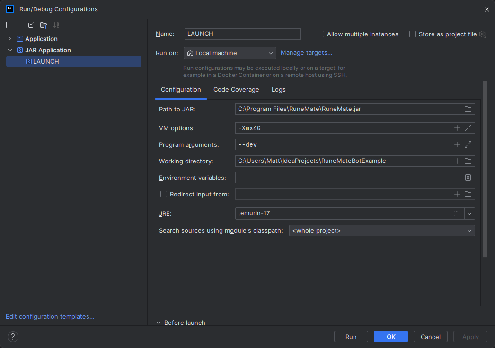

# RuneMate Kotlin Example
A RuneMate Kotlin example bot to get you started developing RuneMate bots in Kotlin!
This project and guide have only been tested on Windows, but the guide should work for MacOS as well.

This guide isn't meant to teach you how to make a bot in Kotlin, just how to set up your IDE.

## Getting started

### Install Temurin 17 JDK

You will need to install the Temurian 17 JDK in order to develop for RuneMate. You can do so by following these instructions.

#### Step 1: Open Project Structure

In your IntelliJ IDE, navigate to `File -> Project Structure`. This will open the Project Structure dialog.

#### Step 2: Set up Project SDK

In the Project Structure dialog, select Project from the options on the left.

Under Project SDK, click on the drop-down menu. If you already have `Temurin 17` installed, it should appear in this list. If not, you will need to download it.

#### Step 3: Download JDK

If you do not see Temurin 17 in the list, click on `New... -> Download JDK...`.

In the Download JDK dialog, set the Vendor filter to Eclipse Temurin. The version number should be 17. Click on Download to start the download process

#### Step 4: Set Project SDK to Temurin 17

Once the download is complete, Temurin 17 should now be an option in the Project SDK drop-down menu. Select it and click OK to close the Project Structure dialog.

### Install Module Dependencies

You will need to add `RuneMate.jar`, `kotlin-stdlib.jar` and `runemate-game-api.jar` to your project as module dependencies.

- Click on File from the toolbar.
- Select Project Structure option (`CTRL + SHIFT + ALT + S` on Windows/Linux, `⌘ + ;` on Mac OS X).
- Select Modules at the left panel.
- Select Dependencies tab.
- Click on the `+` icon.
- Select the `JARs or directories` option.
- Navigate to the location of your `RuneMate.jar`, typically located at `C:\Program Files\RuneMate\RuneMate.jar` for Windows users.

You will need to repeat the above steps to add `runemate-game-api.jar` and `kotlin-stdlib.jar` to your module dependencies.
Both of these files can typically be found at `C:\Users\<YourUser>\RuneMate\resources`

Your module dependencies should look something like this.

### Set up the Run Configuration

Now that we have all of our dependencies taken care of, we'll want to be able to test that our bot is working and our project is set up correctly. We can do this by setting up a Run Configuration.

Step 1: Open Run/Debug Configurations

In IntelliJ, navigate to `Run -> Edit Configurations`. This will open the Run/Debug Configurations dialog.

Step 2: Add a new JAR Application configuration

Click on the `+` button on the top left of the dialog and select `JAR Application`. This will create a new `JAR Application` configuration. From here, you can specify a name for the configuration! I recommend something like `"LAUNCH"`

Step 3: Specify the JAR file

In the configuration settings, click on the ... button next to the Path to JAR field. Locate and select the RuneMate.jar file, typically located at `C:\Program Files\RuneMate\RuneMate.jar`.

Step 4: Provide program arguments

In the `Program arguments` field you will need to specify the `--dev` flag.

Step 5: VM options

You may need to allocate more memory to RuneMate and your bot, to do this you can specify `-Xmx4G` in VM Options to allocate 4 GB of memory to RuneMate and your bot.

Your Run Configuration should look something like this.

Click Apply to save your configuration, then OK to close the dialog.

### Automatically build project before launch

That's pretty much it but there is one last optional step. If you run the launch configuration that we created previously, it will launc RuneMate.jar but it won't build your project. You can build your project manually by navigating to `Build -> Build Project`
If you want your project to build automatically then read on!

The keen-eyed among you will probably notice that there is already a Run Configuration called "BUILD" configured in the project. In order to utilise this Run Configuration, we can open our LAUNCH configuration that we configured previously. At the bottom of the LAUNCH run configuration's window you will see a section titled "Before Launch"
Go ahead and hit the `+` Icon here and select `Run Another Configuration` and select `BUILD`

Now when you run the `LAUNCH` run configuration, your project will build automatically!

### Get RuneMate to recognize the ExampleBot

By default, when you launch, the examplebot isn't going to show up in RuneMate. That's because we need to tell RuneMate to look inside your project's build directory for your bots.

To do this, run the `LAUNCH` run configuration and 

## What next?

Congratulations, Your IDE has been set up successfully! But you might be asking yourself "What now?"

You can get started making your bot by checking out some tutorials on the RuneMate forums.

